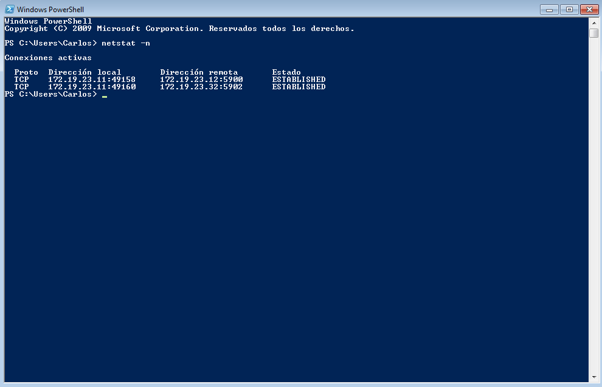
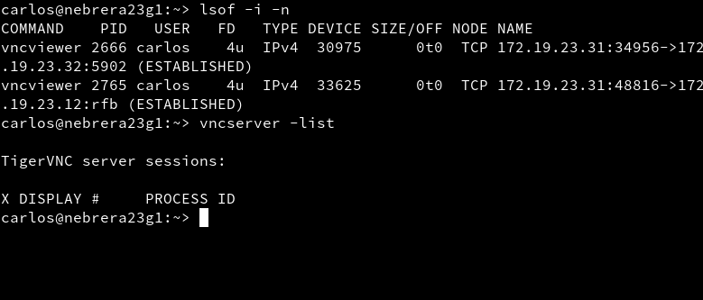

# Acceso remoto con VCN

## Comprobación final VNC Windows
Conectamos el equipo master (ip `172.19.23.11`) a dos slave, uno con sistema operativo Windows y otro con OpenSuse 15.

 * Para realizar esta conexión hemos usado la aplicación `TightVNC`, la cual es una herramienta libre para Windows

> IP OpenSuse -----> 172.19.23.32

 > IP Windows -----> 172.19.23.12

## Comprobación final VNC Linux

Ahora es un equipo, pero con sistema operativo OpenSuse (ip `172.19.23.31`), el que actúa de master.

* Es importante fijarse si los puertos VNC del cortafuegos están abiertos
