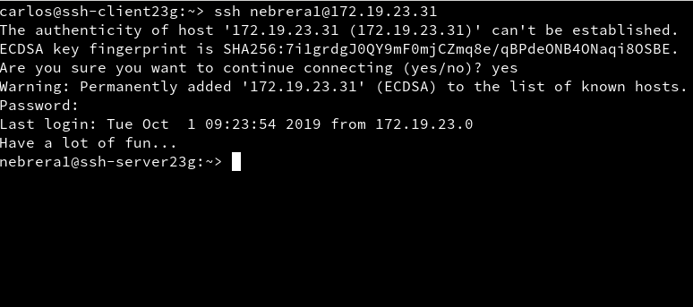
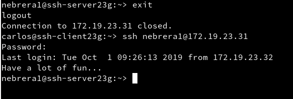

# Acceso remoto SSH

| Criterios             |
| --------------------- |
| (2.2) Primera conexión SSH GNU/Linux       |
| (3.2) Comprobar cambio clave servidor SSH  |
| (5  ) Autenticación mediante clave pública |
| (6  ) Uso de SSH como túnel para X         |
| (8.1) Restricción sobre un usuario         |

## 2.2 Primera conexión SSH desde cliente GNU/Linux

## 3.2 Comprobar cambio clave servidor SSH

## 5 Autenticación mediante clave pública

## 6 Uso de SSH como túnel para X

## 8.1 Restricción sobre un usuario
