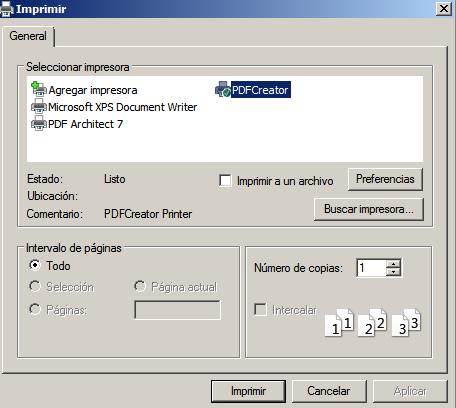
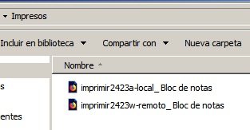

# Servidor de Impresión en Windows

| Secciones |
|-----------|
| **(1.3) Comprobar que se imprime de forma local** |
| **(2.2) Comprobar que se imprime de forma remota** |
| **(3.3) Comprobar que se imprime desde el navegador** |

---

#### (1.3) Comprobar que se imprime de forma local

- Probamos la impresión remota con el documento `imprimir2423a-local`.

- Selecionamos la impresora que hemos creado:

- Comprobamos que se imprime:

---

#### (2.2) Comprobar que se imprime de forma remota

- Buscamos los recursos de red del servidor(Si tarda en paracer ponemos la IP del servidor `\\172.19.24.11`). Además le damos a conectar.

- Probamos la impresión probando el documento `imprimir2423w-remoto`

-Le damos a imprimir y seleccionamos la impresora compartida:

- Comprobamos que se imprime:

---

#### (3.3) Comprobar que se imprime desde el navegador
 
- Accedemos a la configuración de la impresora a través del navegador y ponemos en pausa los trabajos de impresión.

- Por ultimo le damos a reanudar para que el archivo se convierta en PDF.

- Comprobamos que se imprime:

