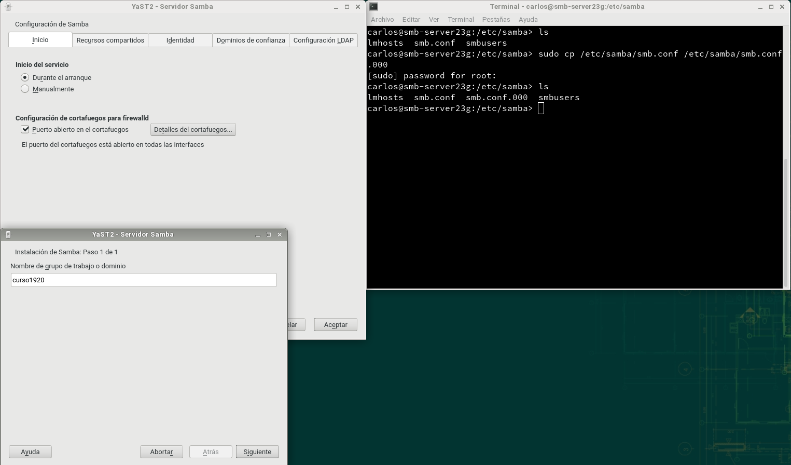

# Samba (con OpenSUSE y Windows)

Ejemplo de rúbrica:

| Sección |
| --------------------- |
| **(1.4 y 1.5) Fichero smb.conf**             |
| **(2.1 y 2.2) Conexión SMB desde Windows**   |
| **(3.1 y 3.2) Conexión SMB desde GNU/Linux** |
| **(3.3) Montaje automático**                 |

---

#### (1.4 y 1.5) Fichero smb.conf

---

#### (2.1 y 2.2) Conexión SMB desde Windows

---

#### (3.1 y 3.2) Conexión SMB desde GNU/Linux

---

#### (3.3) Montaje automático

