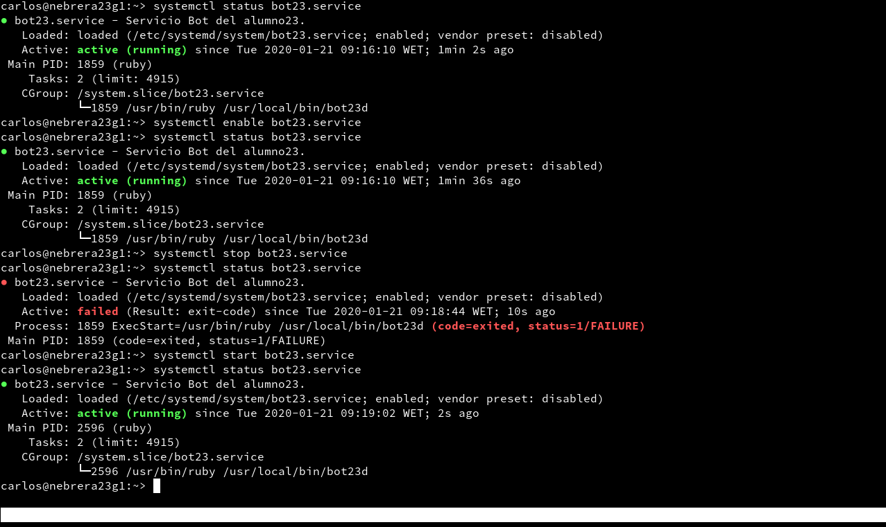
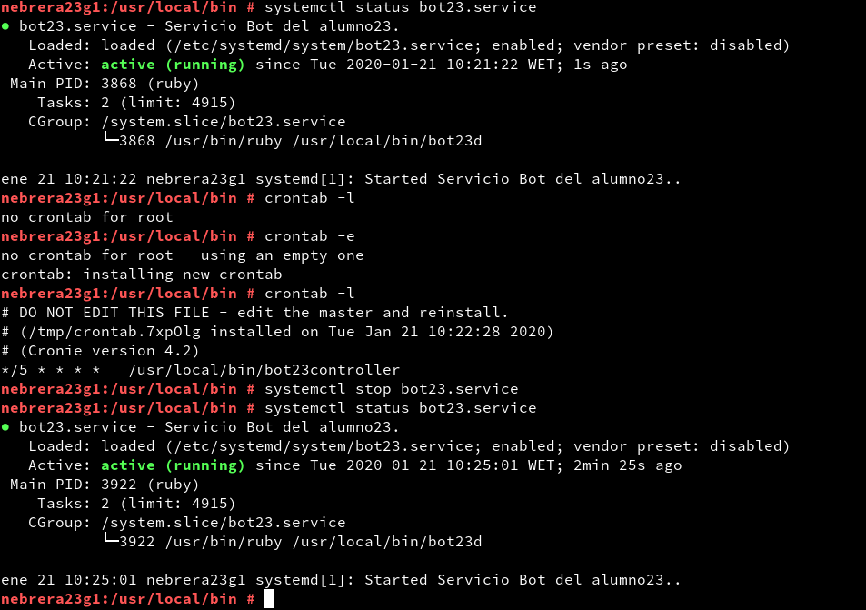

# Servicio de comunicaciones con Telegram (bot-service)

| ID  | Criterio |
| --- | -------- |
| 1.4 | Entrega  |
| 2.4 | Entrega  |
| 3.2 | Tareas programadas |

## 1.4 Entrega.

* **URL vídeo Youtube:** https://www.youtube.com/watch?v=pdgCUdCBKvc.

* **Script del bot:** [bot-demo.rb](files/bot-demo.rb).

## 2.4 Entrega

* **Fichero de configuración del servicio:** [bot23.service](files/bot23.service).

* **Capturas de pantalla iniciando el sericio con `systemctl`.**

## 3.2 Tareas programadas.

* **Captura de pantalla usando `crontab`.**

