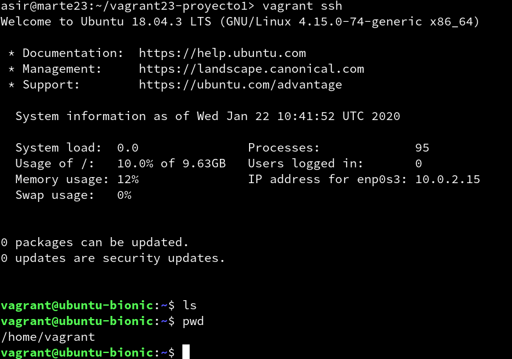

# Vagrant con VirtualBox

| Sección               |
| --------------------- |
| (3.3) Comprobar proyecto 1    |
| (5.2) Comprobar proyecto 2    |
| (6.1) Suministro Shell Script |
| (6.2) Suministro Puppet       |
| (7.2) Crear Box Vagrant       |

## (3.3) Comprobar proyecto 1.

* Comprobamos la salida del comando `vagrant up`.


* Comprobamos la salida del comando `vagrant ssh`.



## (5.2) Comprobar proyecto 2.

* Comprobaremos que el puerto 4567 está a la escucha, para ello usamos `vagrant port`.


* Abrimos el navegador web con el URL http://127.0.0.1:4567.


## (6.1) Suministro Shell Script.

* En primer lugar vamos a crear un directorio llamado *vagrant23-proyecto3* al cual le pondremos detro un Vagrant. Por otro lado creamos un directorio html con un index.html dentro. Además creamos un script, al cual daremos permiso de ejecución con el comando `chmod +x install_apache.sh`.


* Tenemos que añadir las siguientes lineas al archivo Vagrantfile para que use el script, enrute el puerto 4567 del sistema anfitrión al puerto 80 del sistema virtualizado y por ultimo para sincronizar la carpeta exterior html con la carpeta interior.


* Verificamos que Apache ha sido instalado mediante el script yendo al navegador web de la máquina real con la URL http://127.0.0.1:4567.


## (6.2) Suministro Puppet.

* Creamos el directorio *vagrant23-proyecto4* y usaremos vagrant en él. Por otro lado añadimos lo siguiente al archivo Vagrantfile:

```
Vagrant.configure(2) do |config|
  ...
  config.vm.provision "shell", inline: "sudo apt-get update && sudo apt-get install -y puppet"

  config.vm.provision "puppet" do |puppet|
    puppet.manifest_file = "nombre-del-alumnoXX.pp"
  end
 end


```


* Creamos el fichero manifests/mipuppet.pp, con las órdenes para instalar el programa **"nmap"**


* Comprobamos que se ha instalado el programa.


## (7.2) Crear Box Vagrant

* Creamos una carpeta llamada vagrant23-bulls.


* Nos aseguramos que la máquina que vamos a usar esta apagada. Luego de ello lanzamos el comando `vagrant package --base Suse_server_add add.box` para crear nuestra caja.


* Finalmente nos aseguramos que la caja se ha creado correctamente usando el comando `vagrant box list`.


