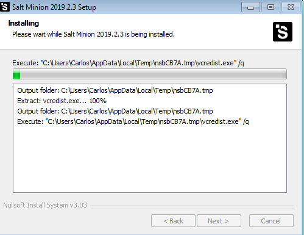

# Salt-stack

### Configuración:

| Config   | MV1           | MV2          | MV3          |
| -------- | ------------- | ------------ | ------------ |
| Alias    | Máster        | Minion       | Minion       |
| Hostname | master23g     | minion23g    | minion23w    |
| SO       | OpenSUSE      | OpenSUSE     | Windows 7    |
| IP       | 172.19.23.31  | 172.19.23.32 | 172.19.23.11 |


## 1.- Instalación y configuración.

### 1.1.- Máster.

* En primer lugar vamos a instalar el software máster mediante comandos. Para ello ejecutamos `zypper install salt-master`.

* Modificamos la configuración de nuestro *Máster*. Para ello vamos a `/etc/salt/master` y añadimos lo siguiente:

````
interface: 172.19.23.31
file_roots:
  base:
    - /srv/salt
````

Comprobamos que se ha activado e iniciado correctamente. Además consultamos los "minions" aceptados por nuestro por nuestro Máster.


> Como se ha inicio la instalación no debe de haber ningún minion aceptado.

### 1.2.- Minion.

* Instalamos el software del agente minion. mediante comandos. Para ello ejecutamos `zypper install salt-minion`.

* Configuramos el fichero `/etc/salt/minion`, añadiendo lo siguinte:

````
master: 172.19.23.31

````

Activamos el minion y lo iniciamos.


Por útlimo comprobamos que no esta instalado apache2.


### 1.3.- Aceptación desde Máster.

Para esta activado hace falta desactivar el firewall de OpenSUSE. Para futuras instalaciones consultar documentación de la conexión al servicio Salt. Por ahora ejecutamos el comando `systemctl stop firewalld`.

 * Comprobamos desde la máquina máster que el minion ha mandado la petición. Para ello ejecutamos el comando `salt-key -L`.+


 * Luego aceptamos la petición con `salt-key -a minion23g`.


 * Por último ejecutamos el mismo comando que al principio para comprobar que se ha aceptado.


### 1.4 Conectividad.

Comprobamos conectividad desde el Máster a los Minions.


## 2.- Salt-States.

### 2.2.- Directorios de los estados

* Creamos directorios para base, donde se guardarán los estados, y devel, para desarrollo y hacer pruebas.


* Además creamos el archivo `/etc/salt/master.d/roots.conf` con lo siguiente:

```

file_roots:
  base:
    - /srv/salt/base
  devel:
    - /srv/salt/devel

```

* Por ultimo reiniciamos el servicio del Máster.


### 2.3.- Nuevo estado.

* Creamos el fichero `/srv/salt/base/apache/init.sls` con lo siguinte:

```
install_apache:
  pkg.installed:
    - pkgs:
      - apache2

apache_service:
  service.running:
    - name: apache2
    - enable: True

```

### 2.4.- Minions a estados.

* Creamos el fichero `/srv/salt/base/top.sls` en el Máster, donde se asociarán a todos los Minions con el estado que acabamos de crear. Ponemos lo siguiente dentro:

```

base:       
  '*':
    - apache

```

### 2.5.- Comprobar estados definidos.

Para ello ejecutamos el comando `salt '*' state.show_states` para ver el estado que tenemos definidos para cada Minion.


### 2.6.- Aplicar nuevo estado.

* Primero, antes de aplicar el nuevo estado, consultamos que no tenemos errores en las definiciones con los comandos `salt '*' state.show_lowstate` y `salt '*' state.show_highstate`.


* Luego de ello aplicamos el nuevo estado de a todos los Minions con el comando `salt '*' state.apply apache`.


* Por último comprobamos en la máquina minion.


## 3.- Crear más estados.

### 3.1.- Estado "users".

* Creamos el directorio `/srv/salt/base/users`. Dentro de este creamos el fichero `init.sls`. Con las definiciones para crear un grupo y dos usuarios.


* Luego de ello aplicamos los cambios con `salt '*' state.apply users`


* Por ultimo comprobamos que se han creado los usuarios.


### 3.3.- Estado "directories".

* Creamos un estado el cual cree 3 carpetas: `private` (700), `public` (755) y `group` (750). Todo ello dentro del home del usuario koji23. Para ello Creamos el directorio `/srv/salt/base/directories`. Dentro de este creamos el fichero `init.sls` y ponemos lo siguinte:


* Luego de ello aplicamos los cambios con `salt '*' state.apply directories`.


* Por ultimo comprobamos.


## 4.- Windows 7 minion.

* Instalamos salt-minion.



* Aceptamos en la máquina Máster.


