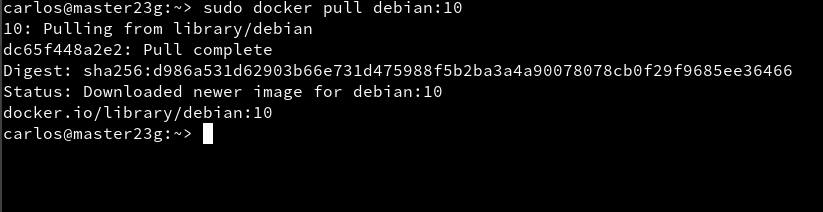

# Contenedores con Docker

## 1.- Requisitos.

Se recomienda usar un sistema operativo GNU/Linux. Además la versión del *kernel* de esta misma debe ser superior a la **3.10.**

* Para comprobar esto ejecutamos el comando `uname -a`. Así podremos ver la versión del *kernel*.


Por otro lado, debemos de tener activa la opción `IP_FORWARD`. Así tendremos habilitado el acceso a la red externa a los *contenedores*.

* Debemos ir a Yast -> Ajustes de red -> Encaminamiento -> Habilitar reenvío IPv4.


> Reiniciar el equipo para que se apliquen los cambios en la configuración.

## 2.- Instalación

Para proceder a la instalación iniciamos seción como superusuario. Luego de ello ejecutamos el comando `zypper in docker`.


Luego iniciamos el servicio con el comando `systemctl start docker`.


Por último vemos la versión de docker con `docker version`


## 3.- Primera prueba.

* Ejecutamos el comando `docker images` y `docker ps -a` para ver las imágenes descargadas y los contenedores creados. No debe aparecer nada.


En la primera prueba nos descargaremos y ejecutaremos un contenedor con la imagen "hello-world". Esto nos mostrará un mensaje en pantalla.

* En primer lugar vamos a descargar y ejecutar el contenedor con el comando `docker run hello-world`.


* Vemos la nueva imagen con `docker images`.


* Ejecutamos el comando `docker ps -a` para ver el estado del contenedor. Debe de ser *Exited*.


## 4.- Creación manual.

Vamos a instalar un contenedor **Debian** y dentro instalaremos *Nginx*.

* Para empezar vemos las imágenes disponibles localmente con el comando `docker images`.


* Buscamos en los repositorios de Docker contenedores con la etiqueta *debian*. Esto lo hacemos con el comando `docker search debian`.


* Descargamos una imagen *debian:10* con el comando `docker pull debian:10`.



* De nuevo ejecutamos `docker images` para ver las imágenes disponibles.


* Vemos todos los contenedores y los que están  en ejecución.


Por último creamos un contenedor con nombre *con_debian* a partir de la imagen *debian:10*, y ejecutaremos */bin/bash* con el siguiente comando `docker run --name=con_debian -i -t debian:9 /bin/bash`.


## 4.1.- Creación manual.

Personalizamos a nuestro gusto el contenedor. Para ello ejecutamos los siguientes comandos.

* Comprobamos que estamos en Debian `cat /etc/motd`


* Instalamos Nginx `apt-get install -y nginx`.


* Instalamos editor vi `apt-get install -y vim`


* Creamos fichero html (holamundo.html) `echo "<p>Hola nombre-del-alumno</p>" > /var/www/html/holamundo.html`


* Por último creamos un script con el contenido siguiente:

```

#!/bin/bash
echo "Booting Nginx!"
/usr/sbin/nginx &

echo "Waiting..."
while(true) do
  sleep 60
done

```

> Recordar dar permiso de ejecución al script.

## 4.2.- Crear una imagen a partir del contenedor.

Vamos a crear la nueva imagen que se llamará "carlos/nginx" `docker commit con_debian carlos/nginx`.


Comprobamos con `docker images`.


## 4.3- Crear contenedor a partir de nuestra imagen.

* Iniciamos la imagen del conetenedor con el comando siguiente: `docker run --name=con_nginx -p 80 -t calos/nginx /root/server.sh`.


* Comprobamos mediante internet los resultados. Miramos el archivo html creado en el paso anterior.


* Por ultimo comprimimos nuestra imagen de Docker en un fichero.


## 5. Dockerfile.

En primer lugar vamos a crear un directorio y copiar los ficheros creados anteriormente. Además creamos un fichero Dockerfile con el contenido siguiente:


* Luego crearemos una imagen a partir del Dockerfile.


* Luego de ello creamos un contenedor.


* Comprobamos en el navegador.


* Usando imagenes ya creadas podemos hacer lo mismo. Para ello primero creamos un nuevo directorio y creamos dentro un Dockerfile con el siguiente contenido:


> Hace falta tener el holamundo.html dentro.

* Por ultimo ejecutamos los siguientes comandos:


Para acabar paramos y eliminamos todos los contenedores.

* `docker ps -a`
* `docker stop ...`
* `docker rm ...`
Lo mismo con las imágenes:
* `docker images`
* `docker rmi ...`
